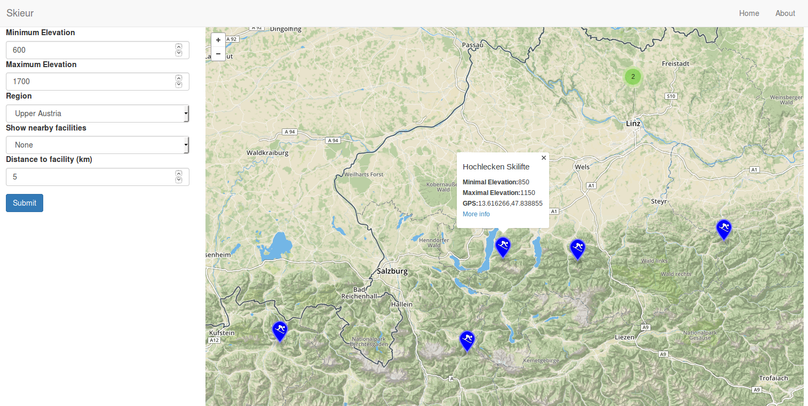
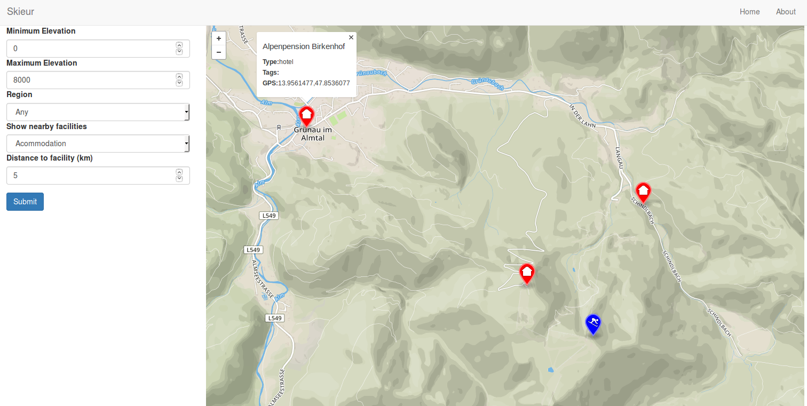
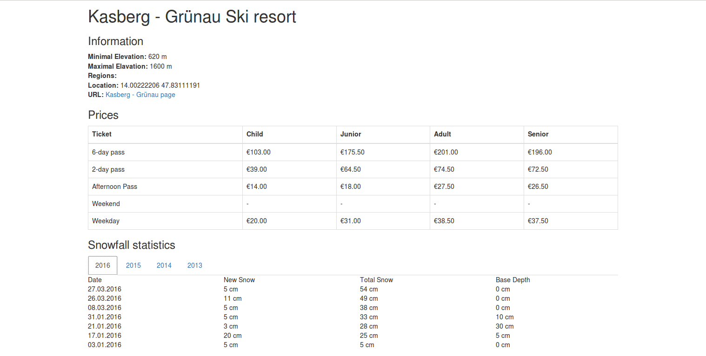

# Overview - Skieur - your Europe Skiing Guide

The application shows ski resorts in Europe on a map. It allow user to filter these resorts with specific filters.
- filtering by minimal and maximal elevation of resort
- filtering by resort regions

Users are also able to show nearby facilities such as ski schools, ski rentals and various accomodation facilities
-  filter by facility type and distance from ski resorts

Users can view resort detail, containing basic resort information, ticket prices and snowfall data.

## Application screenshots

Showing all resorts with longitude and latitude for selected region

Showing all resorts along with accomodation facilities

Showing resort detail

# Frontend

The frontend of application uses standard rails ERB templates, which are generating static html files. Home page shows basic navbar, map and sidebar.
There are also javascripts in the html files, which support map rendering and simple functions for API calls. 

Features:
- displaying geodata in map
- reloading map data on map moved, map zoomed
- displaying marker popups
- showing resort detail page 

# Backend

Backend is written in Ruby on Rails. It consists of data handling, resort page data methods and API. Each API call is defined also in routes.

## Data

Data uses openstreetmaps (Europe dataset) downloaded from http://download.geofabrik.de/europe.html. Application is capable to handle also subsets of this dataset, but it will not show facilities in not included countries (data are used only for facilities).
Secondly, records for ski resorts, regions, prices and snowfall data are downloaded from http://onthesnow.co.uk/, using their Rest API and our crawler. 

## Api

** Find ski resorts inside square map bounds filtered by minimal and maximal elevation

`GET /ski_resorts.json?minlat={}&maxlat={}&minlng={}&maxlng={}&minElev={}&maxElev={}`

** Find ski resorts inside square map bounds filtered by minimal and maximal elevation and selected region

`GET /ski_resorts_reg.json?minlat={}&maxlat={}&minlng={}&maxlng={}&minElev={}&maxElev={}&region={region_id}`

** Find ski resorts inside square map bounds filtered by minimal and maximal elevation along with facilities of selected type

`GET /ski_resorts_fac.json?minlat={}&maxlat={}&minlng={}&maxlng={}&minElev={}&maxElev={}&facilities={fac_type}&distance={}`

** Find ski resorts inside square map bounds filtered by minimal and maximal elevation along and selected region with facilities of selected type

`GET /ski_resorts_fac_reg.json?minlat={}&maxlat={}&minlng={}&maxlng={}&minElev={}&maxElev={}&region={region_id}&facilities={fac_type}&distance={}`

## Response

API calls return JSON in geojson format.
